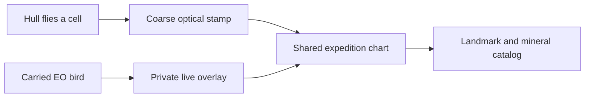

# Survey expedition — PVE mapping direction

This is a design exploration, not a live rule change. The field manual still
describes the current match: five kits, ION / EMBER friendly-fire rules, personal
score, and Earth-observation hulls that orbit as interceptors.

## Recommendation

Keep one ship per player. Do not add exclusive character-select jobs. Do not
add competing combat factions. Make **one expedition** whose product is a
**shared chart** of a world that starts unknown.

Uniqueness comes from the six existing EO birds (one Landsat 7, one Terra, one
Aqua, one GOES-16, one ENVISAT, one WorldView-3). Each bird paints a GIS layer
only its carrier can see live. Everyone else sees the stamped chart. Kits stay
as how you fly and clear hazards: Dart covers ground, Hauler relocates rocks
and hardware, Warden escorts the bird, Skirmisher clears a field, Quake settles
terrain.

That scales because two players split two sensors on a small catalog, and a
crowd keeps all six birds alive while the chart decays and events keep arriving.
The physics arena stays the current 6,000-unit circle. Work scales with
**layers, catalog tasks, and upkeep**, not a larger simulation.

## What the game already is

GeoRoids is already a GIS toy wearing an Asteroids coat, then asking players to
treat it as a skirmish.

- Seeded hills, valleys, and saddles with a flat spawn. Contours and slope force
  are shared by the room (`src/physics/terrain/`). Every client already draws the
  whole map.
- Six named Earth-observation hulls already spawn as a closed roster
  (`shared/eoSatellites.ts`, `SATELLITE_PICKUP.MAX_COUNT` is 6). They auto-collect
  and become orbiting interceptors. The names are real sensors; the play is a
  shield.
- Six gaussian landmarks already sit in the mid-ring of the heightfield
  (`TERRAIN.LANDMARK_COUNT`). Players cannot fail to find them, because contours
  are free.
- Cooperative asteroid splits, Warden projection, and Hauler harpoon are already
  team verbs. Soft factions exist only to turn friendly fire off and tint hulls.
  There is no team score, no shared win, and personal score still leads.

The GIS content is visible. Mapping is not a goal. That is the gap.

## Why “map the world” is the right PVE goal

A mapping game has a verb the current match lacks: **go look, then leave a
record other people can use**. Combat, slope, ice, metal, and storms become
reasons the record is expensive, not the reason you showed up.

It also simplifies the social contract. Anyone who joins is on the expedition.
You stop asking “is that hull a teammate or a farm?” ION / EMBER can remain
cosmetic agency paint or retire in this mode. Lots of factions would hide maps
from each other and fight the Earth-observation fantasy (Landsat, Terra, Aqua,
GOES, ENVISAT, and WorldView are complementary instruments, not warring fleets).

A later optional **agency race** (two expeditions, same world, coverage quality
as the score, little or no shooting) can wait. It is a mode, not the base loop.

## One ship, or one hull per player?

A single shared hull with crew stations (helm, gunner, mapper) is excellent for
two to four people on voice. It is a bad default for GeoRoids:

- The current fantasy is “I am the ship.” Phone players already fly that loop.
- One helm becomes a bottleneck at five or more players.
- Twenty players on one bridge is noise, not a role.

Keep **one hull per player**. If a two-player crew overlay is worth a later
experiment, it is an optional wingman seat on an existing hull (pilot plus
sensor officer), not the architecture the whole population has to fit.

“Only one of you” still holds: only one ENVISAT exists. The person carrying it
is the radar. If they die, the bird drops. Duplicates of a *kit* are allowed;
duplicates of a *bird* are not, because the roster is already unique.

## Information model

The current minimap is a free god-view of ships, rocks, loot, and pickups. A
mapping game needs the opposite: the chart is empty until someone surveys.

Split vision into two products:

| View | Who sees it | Lifetime |
| --- | --- | --- |
| Local camera | You, in the ordinary playfield window | Now. Rocks and slopes in frame are real. Unsurveyed terrain beyond the window stays dark. |
| Live instrument | Only the hull carrying that bird | Now. Goes away when the bird is dropped or destroyed. |
| Shared chart | The whole expedition | Stamped cells persist, then can decay if unvisited. This is the expedition scoreboard. |

That is the information you provide that others do not: a live layer. You do
not need a private codebook or a unique job title. The Warden does not need
radar; they need to keep the radar hull alive. The Dart without a bird still
paints the coarse optical layer by flying, which is enough for two-player
coverage and for late joiners.

### Bird to layer

Map the existing roster onto layers the heightfield and asteroid field already
contain. No new world generator.

| Bird | Real instrument | Live overlay (carrier only) | Stamp on the chart |
| --- | --- | --- | --- |
| Landsat 7 | Optical / land cover | Contour lines in a radius | Terrain coverage |
| Terra | Multi-instrument land | Slope vectors; steep vs climbable | Traversability |
| Aqua | Water / ice | Ice rocks and fuel-bearing ice glow | Hydrology / ice fields |
| GOES-16 | Weather nowcast | Predicted rock and storm tracks | Last-known hazard tracks |
| ENVISAT | SAR | Metal and reflective clusters through dust | Mass / metal veins |
| WorldView-3 | High-res optical | Elevation numbers and landmark identity | Official catalog stamps |

A hull carries **at most one** bird. Solo play swaps birds to paint layers in
sequence. Two players run two layers at once. Six or more can run the full
instrument suite if they keep the hardware alive.

Everyone can still shoot, collect mass, and escort. The bird is a sensor, not
a class lock at the title screen.

## Kits as expedition jobs

Do not replace the five locked hulls. Re-aim their abilities at the chart.

| Kit | Expedition job | Already in the kit |
| --- | --- | --- |
| Dart | First coverage | Boost dash into unsurveyed cells |
| Hauler | Logistics | Harpoon to drag a rock off a survey site or tow a loose bird into a useful orbit |
| Warden | Escort | Projected shield on the bird carrier |
| Skirmisher | Field clear | Ring fire to open a dense belt so someone else can map |
| Quake | Terrain | Already tagged `flavor: 'geo'`. Pulse to shove rubble, settle a landing, or expose a buried metal read |

If two Darts join, the expedition maps faster. That is correct. Unique *jobs*
at character select fail at two players (missing specialist) and at twenty
(queue for the one radar slot). Unique *hardware* in the world does not.

## Scaling

Do not grow the 6,000-unit arena or the contour grid to soak extra players.
Mobile and snapshot budgets already treat that world as the working set.

Let `P` be living human hulls. Scale the *assignment*, not the physics:

| Humans | What “fun” means | Completeness target | Pressure |
| --- | --- | --- | --- |
| 1 | Swap birds, paint layers in sequence, still finish a small catalog | Optical plus one extra layer; 3 of 6 landmarks | Low decay. Asteroids only. Bots off or non-hostile. |
| 2 | Complementary pair (for example Landsat + ENVISAT). One maps, one peels rocks, then swap | Two layers; all 6 landmarks | Slow decay. Occasional swarm. |
| 3–6 | One bird each is the sweet spot. Kits decide who escorts and who clears | All carried layers; landmarks plus metal/ice catalog | Birds are fragile. Losing ENVISAT blanks live radar until it respawns. |
| 7+ | Extra hulls escort, re-deploy dropped birds, and answer events. They are not unemployed if the chart still decays | Same world, higher upkeep. More simultaneous swarms and scramble events | Faster decay. Interference that unstamps cells. |

Rules that make the large-player case stay a game instead of a 20-second mop-up:

1. **Decay.** Unvisited cells fade. The chart is a garden, not a one-time
   paint-by-numbers. Late joiners always have somewhere to fly.
2. **One bird per hull.** A single player cannot pocket the whole instrument
   suite in a crowded match.
3. **Events, not a bigger map.** Dust that blinds optical but not SAR. A metal
   storm that needs Skirmishers while Darts keep covering. A scramble drone
   that unstamps a region (a PVE replacement for today’s hunting bots).
4. **Catalog quality.** Completeness is not only area. Landmark identity,
   ice fields, and metal veins are extra stamps WorldView / Aqua / ENVISAT
   exist to finish.

Two players never need the other four specialists to exist. They fly two
layers and a shorter catalog. Twenty players never need twenty unique jobs.
They need a chart that does not stay finished.

## What this simplifies

Stop leading with personal kill score, lives-as-the-match, and “which side is
that hull.” Keep flying, shooting rocks, slope, kits, and the six birds.

Demote or mode-gate:

- Combat factions as a damage rule. Default expedition: no player-versus-player
  damage. Ricochets and loot blasts can stay environmental.
- Hunting bots. Replace later with interference / scramble drones, or leave
  asteroids as the only PVE in the first slice.
- Minimap as an omniscient radar. It becomes the chart.

Keep, because they already serve a mapping expedition:

- Cooperative splits (clearing a large rock is a team survey problem).
- Reflective metal (ENVISAT and laser-core play stay meaningful).
- Mass growth and fuel (Hauler and Quake still have a resource loop).
- The locked silhouettes and EO outlines (no sixth hull, no new bird).

## First playable slice

Build the smallest thing that answers “is flying-to-map fun?” before teaching
six instruments.

1. Server-owned survey grid clipped to the circular boundary. A living human
   hull occupying a cell for a short dwell stamps coarse optical.
2. Public snapshot carries a compact coverage bitset (a 64×64 grid is 512
   bytes uncompressed; pack or delta it). Do not send a new world.
3. Client draws contours, elevation labels, and minimap marks only in stamped
   cells. Unsurveyed space is dark. Local camera still shows what is in frame.
4. HUD replaces “this is a deathmatch score” as the primary number with
   expedition coverage percent. Personal score can still count first stamps.
5. Leave kits, birds-as-interceptors, and factions in place for this slice so
   the prototype is one system, not a rewrite.

Success: two people in a room split up, the shared minimap fills in, and the
empty half of the circle feels like a reason to fly there. Failure: the fog is
annoying because the camera already showed everything, or coverage completes
so fast the match has no second act (raise dwell time or shrink the stamp
radius; do not grow the world).

Wiki stays on current rules until a slice actually ships. This file is the
design record; `/wiki/` should not describe fog, layers, or a team chart while
the live match still shows the full terrain and a personal score.

## Later slices (only if slice 1 is fun)

1. One-bird-per-hull instrument overlays and chart stamps, using the table
   above.
2. Landmark catalog: the six heightfield peaks and bowls are unknown until
   WorldView (or a close optical survey) classifies them.
3. Convert bots from hunting pilots to scramble / interference, or drop them
   from the default expedition.
4. Default friendly fire and ship-collision damage off in this mode.
5. Optional two-player wing seat, and optional two-expedition coverage race.

Parked ideas in `todo.md` (etched marks, asteroid mirages) fit as catalog
content after the chart exists. They are not required to test the loop.

## Open decisions

These are product choices, not implementation details:

- Does a wiped expedition fail the chart, or does the chart persist across
  deaths the way score does today?
- Is solo a first-class expedition, or is two the floor?
- Do we hide title-screen terrain the same way, or keep the homepage map as a
  known-world trailer?

Slice 1 can ship with “chart persists, deaths reset the hull, bots unchanged,
title map unchanged” and still answer the fun question.
